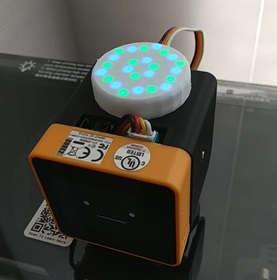

# StackChan_HexLED_demo

NeoPixel互換LED搭載 HEXボード[(スイッチサイエンス販売ページ)](https://www.switch-science.com/products/6058)をｽﾀｯｸﾁｬﾝ(※)に搭載して制御するデモソフトです。

### フォルダ構成

- firmware/lib
  - HEXボードの基本的な制御関数をまとめました。ｽﾀｯｸﾁｬﾝに依存せずM5Stackで使用可能です（ライブラリ化を検討中）。
- firmware/src
  - ｽﾀｯｸﾁｬﾝのAvatarを表示しながらHEXボードを点灯制御するデモプログラムです。
- model
  - HEXボードをｽﾀｯｸﾁｬﾝの頭部に載せるためのパーツ（土台とカバー）の3Dデータです。

※ｽﾀｯｸﾁｬﾝは[ししかわさん](https://x.com/stack_chan)が開発、公開している、手乗りサイズのｽｰﾊﾟｰｶﾜｲｲコミュニケーションロボットです。
- [Github](https://github.com/stack-chan/stack-chan)
- [Discord](https://discord.com/channels/1095725099925110847/1097878659966173225)
- [ScrapBox](https://scrapbox.io/stack-chan/)